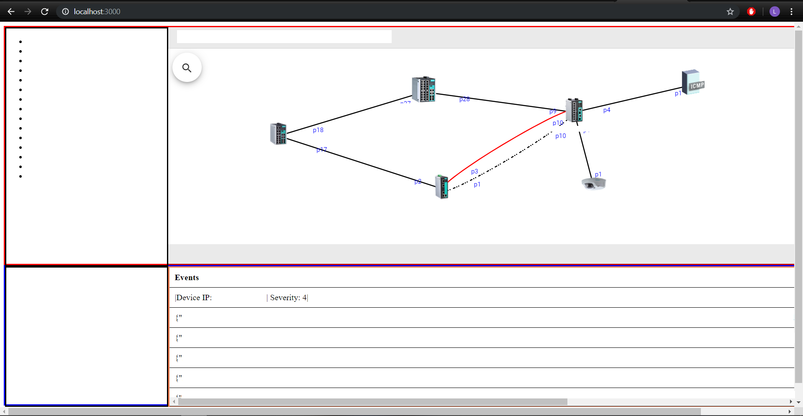
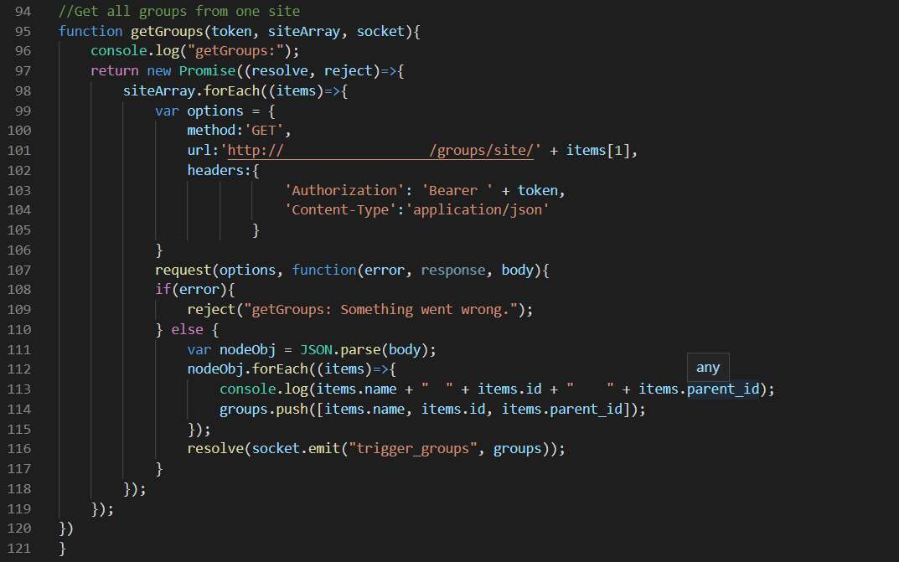
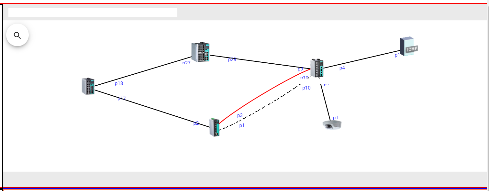
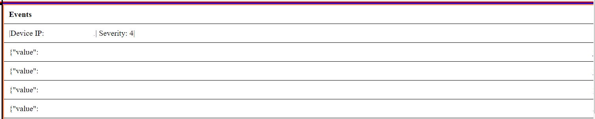
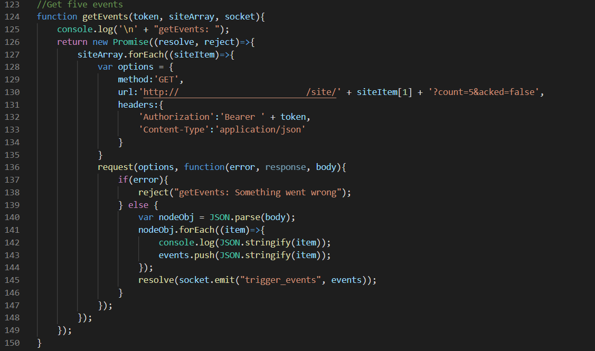
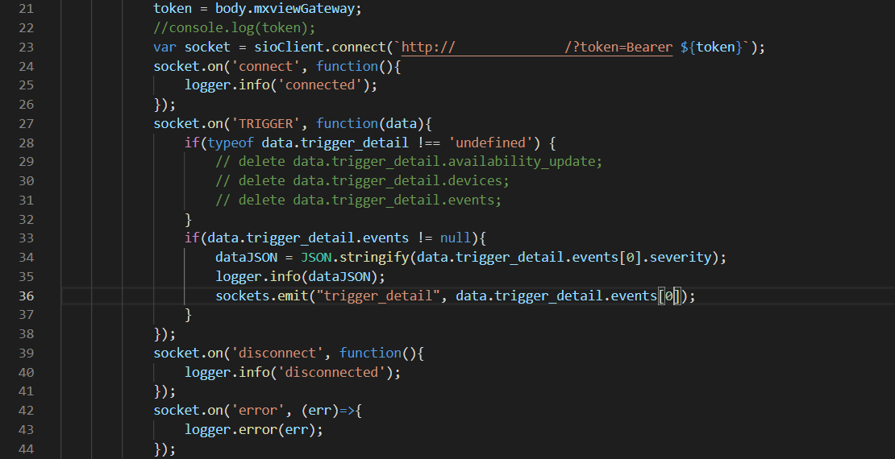

# Simple-MXview-Interface

## Disclaimer 

Should this article infringe any copyright issues, please send me an email. I will take it down immediately.
You may reach me at lekingz94@gmail.com. Some image details have been removed to avoid violating any copyright issues.

## Overview
This article focuses on recreating a simpler version of MXview interface using MXview API. The final result is
shown below.

## Steps:
1) Created a local server using Node.js Express module. 
    Source code:
      server.js
      
2) Developed a simple website for the server to host.
    Source code:
      index.html, style.css
      
3) Established a connection from local server to MXview server using Node.js Express over HTTP
    Source code:
      server.js
      
4) Made RESTful API requests from local server to MXview server using Node.js Requests.
    Source code:
      GetInfo.js
 
5) Obtained real-time event information from MXview server over socket.io.
    Source code:
      RTEvents.js
      
## Group Section

This section covers the entire structural tree of the users' configuration. The groups information
are obtained from an API request to MXview Server. An example code of API request is given below.

Where the request() function takes in the "options variable" which contains all the information required
to make a legit request to the server.

## Widget

This section covers the widget part of the website. The image part of the server is embedded into the
website which allows the user to interact with it. Changes made will be reflected in both the website and
the server.

## Events Section

This section covers the events part of the website. 
There are two features in this section. Firstly, a few most recent events are shown in the events table.
Lastly, the table updates automatically as new real time events from the server is added to the table. 
These two features are done using two different methods, the API method and socket.io method respectively.
1) The API request method (For most recent events)

2) The socket.io method (For real time events)

